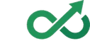

# Nextiweb Studio — Charte de marque

> Document de référence pour l'identité visuelle, le ton, et l'écosystème des deux marques.
> Dernière mise à jour : 5 juin 2026 · Khadija Ait Lassri

---

## 1. Identité

### Nom et URL
- **Nom complet** : Nextiweb Studio
- **Domaine** : `nextiwebstudio.ca`
- **Slogan court** : *Studio créatif & concepts web par secteur*
- **Slogan long** : *Une galerie d'explorations conçues pour montrer ce qu'un site moderne peut faire pour votre métier — avant même qu'on en parle.*

### Mission
Documenter publiquement la méthode de Nextiweb (SEO, GEO/AEO, performance, accessibilité) à travers 6 démos sectorielles et des études de cas honnêtes, pour que les patrons de PME québécoises comprennent **avant** de signer un devis.

### Positionnement
- **Voix terrain** : entrepreneure qui construit, pas consultante qui théorise
- **Honnêteté radicale** : pas de chiffres inventés, sources publiques citées
- **Accent québécois** : « créno », « patron », références culturelles locales
- **Pédagogie sans bullshit** : ce qui marche, ce qui ne marche pas, et pourquoi

### Architecture des deux marques

| Marque | Rôle | URL | Mission |
|---|---|---|---|
| **Nextiweb.ca** | L'agence | `nextiweb.ca` | Signe les contrats, livre les projets, facture |
| **Nextiweb Studio** | Le laboratoire | `nextiwebstudio.ca` | Documente la méthode, montre les concepts |

**Règle stricte :** Studio ne vend rien. Tous les CTA conduisent à Nextiweb.ca avec tracking UTM (`utm_source=nextiwebstudio.ca`).

---

## 2. Couleurs

### Palette principale (mode sombre par défaut)

| Token CSS | Hex | Usage |
|---|---|---|
| `--color-primary` | `#00e676` | Vert signature, CTA, accents, liens |
| `--color-primary-dark` | `#00b85a` | Hover des boutons primaires |
| `--color-primary-glow` | `rgba(0,230,118,0.15)` | Lueurs, ombres autour des accents |
| `--color-primary-soft` | `rgba(0,230,118,0.08)` | Fonds doux pour eyebrows |

### Fonds

| Token CSS | Hex | Usage |
|---|---|---|
| `--color-bg` | `#0a0e1a` | Fond principal du site |
| `--color-bg-elevated` | `#131826` | Cartes, sections élevées |
| `--color-bg-surface` | `#1a2030` | Sous-cartes, code blocks |
| `--color-bg-overlay` | `rgba(10,14,26,0.85)` | Header sticky avec backdrop blur |

### Textes (passent WCAG AA sur fond `#0a0e1a`)

| Token CSS | Hex | Usage | Contraste |
|---|---|---|---|
| `--color-text-primary` | `#f5f7fa` | Titres, contenu fort | 16.8:1 ✅ AAA |
| `--color-text-secondary` | `#a0aec0` | Paragraphes, métadonnées | 7.1:1 ✅ AAA |
| `--color-text-muted` | `#6b7689` | Légendes, mentions discrètes | 4.2:1 ⚠ AA large only |

### Bordures et états

| Token CSS | Hex | Usage |
|---|---|---|
| `--color-border` | `#2a3248` | Bordures cartes |
| `--color-border-light` | `#1f2638` | Séparateurs subtils |
| `--color-border-hover` | `rgba(0,230,118,0.4)` | Bordure au survol |
| `--color-success` | `#00e676` | États positifs (= primary) |
| `--color-warning` | `#ffb800` | Alertes douces |
| `--color-error` | `#ff4757` | Erreurs |

### Convention d'usage

- **Le vert primaire est rare** : 1 à 2 accents par section maximum
- **Jamais de vert sur vert** : un seul niveau d'accentuation
- **Pas de dégradé multicolore** : uniquement `linear-gradient(135deg, #f5f7fa 30%, #00e676 100%)` pour le texte titre

---

## 3. Typographie

### Familles

```css
--font-display: 'Inter', system-ui, -apple-system, sans-serif;
--font-body:    'Inter', system-ui, -apple-system, sans-serif;
--font-mono:    'JetBrains Mono', 'SFMono-Regular', Consolas, monospace;
```

Plus une troisième famille décorative chargée uniquement sur certaines pages :

```css
font-family: 'Sacramento', cursive;  /* signature manuscrite */
```

### Échelle modulaire

| Token | Valeur | Usage |
|---|---|---|
| `--text-xs` | 0.75 rem (12 px) | Petites mentions |
| `--text-sm` | 0.875 rem (14 px) | Métadonnées |
| `--text-base` | 1 rem (16 px) | Corps de texte par défaut |
| `--text-lg` | 1.125 rem (18 px) | Lead intro |
| `--text-xl` | 1.25 rem (20 px) | Sous-titres |
| `--text-2xl` | 1.5 rem (24 px) | Titres de cartes |
| `--text-3xl` → `--text-7xl` | jusqu'à 4.5 rem (72 px) | Titres et héros |

### Hiérarchie sémantique

- **H1** : un seul par page, taille fluide `clamp(2.25rem, 4vw + 1rem, 4rem)`
- **H2** : sections principales, `clamp(1.875rem, 2.5vw + 1rem, 3rem)`
- **H3** : sous-sections, `clamp(1.5rem, 1.5vw + 0.75rem, 2rem)`
- **H4** : ne pas utiliser (préférer H3 stylé en plus petit)

### Lettrage

- `letter-spacing: -0.02em` sur les titres (resserrement subtil)
- `letter-spacing: 0.1em` à `0.15em` sur les eyebrows et labels en majuscules
- `line-height: 1.15` titres / `1.6` corps de texte

### Eyebrows (les labels au-dessus des titres)

```css
.eyebrow {
  font-family: var(--font-mono);
  font-size: var(--text-xs);
  letter-spacing: 0.15em;
  text-transform: uppercase;
  color: var(--color-primary);
  background: var(--color-primary-soft);
  border: 1px solid rgba(0, 230, 118, 0.2);
  border-radius: 9999px;
  padding: 0.5rem 0.75rem;
}
```

---

## 4. Logo

### Fichiers

| Fichier | Format | Dimensions | Usage |
|---|---|---|---|
| `logo-nextiweb-light.webp` | WebP | 127×72 | Header, footer (toutes pages) |
| `logo-nextiweb-light-2x.png` | PNG | 127×72 | Fallback navigateurs très anciens |
| `logo-nextiweb-light.png` | PNG | 169×96 | Source originale (à conserver) |
| `favicon-nextiweb-infini.png` | PNG | 32×32 | Onglet navigateur |

### Affichage code

```html
<a href="/" class="logo" aria-label="Nextiweb Studio, accueil">
  
  <span class="logo-text">
    <span>Nextiweb Studio</span>
    <small>Studio créatif</small>
  </span>
</a>
```

### Règles d'usage

- **Toujours accompagné** du wordmark « Nextiweb Studio » + sous-titre « Studio créatif »
- **Hauteur minimum** : 32 px (en dessous, illisible)
- **Zone de protection** : au moins l'équivalent d'un caractère « N » du wordmark autour du logo
- **Ne jamais** : déformer, recolorer, mettre sur fond clair sans test de contraste

---

## 5. Voix et ton

### Règles éditoriales

✅ **À FAIRE**
- Parler **« nous avons construit »** (Nextiweb = équipe)
- Citer des **sources publiques vérifiables** (Google Search Central, Schema.org, BrightLocal, etc.)
- Dire **« vérifiez vous-même »** quand on présente une donnée
- Utiliser le vocabulaire des entrepreneurs québécois : « patron », « créno », « PME », « MRC »
- Phrases courtes. Verbes d'action. Du concret.

❌ **À NE PAS FAIRE**
- ~~« J'ai audité 27 sites... »~~ — nous sommes au début, pas de fabrication de preuve
- ~~« Je vous garantis... »~~ — éviter les promesses absolues
- ~~Mots associés à l'alcool~~ : « bar », « pub » (Khadija → préférence personnelle)
- ~~Jargon consultant~~ : « synergies », « disruption », « solutions clés en main »
- ~~Témoignages V1~~ : pas de faux clients, on est en bêta honnête

### Structure des articles de blog

1. **Hook problème** (1-2 phrases concrètes)
2. **5 erreurs / leviers / éléments** numérotés (jamais 10, trop dilué)
3. **Démo de référence** dans le labo qui illustre
4. **FAQ structurée** (Schema FAQPage)
5. **Sources publiques** en fin d'article

### Signature manuscrite

Khadija signe ses articles avec une signature en police `Sacramento`, suivie de « Khadija Ait Lassri » en monospace petit. Effet d'authenticité humaine, pas de pseudo « brand voice ».

---

## 6. Composants visuels

### Boutons

```css
.btn-primary    /* Vert plein, fond #00e676, texte sombre */
.btn-secondary  /* Bordure verte, fond transparent */
.btn-ghost      /* Texte clair, bordure grise discrète */
.btn-link       /* Texte vert + flèche → animée au hover */
```

### Cartes

- Fond : `--color-bg-elevated` (#131826)
- Bordure : 1px `--color-border`
- Radius : `--radius-lg` (16 px)
- Hover : bordure passe à `--color-border-hover` (vert 40%)
- Padding intérieur : `--space-6` à `--space-8`

### Espacements

Échelle multiple de 0.25 rem (4 px) :

```
--space-1: 4 px
--space-2: 8 px
--space-3: 12 px
--space-4: 16 px
--space-6: 24 px   ← le plus utilisé
--space-8: 32 px
--space-12: 48 px
--space-16: 64 px
--space-24: 96 px  ← sections verticales
```

### Sections

```css
.section {
  padding-block: clamp(4rem, 8vw, 8rem);  /* 64–128 px adaptatif */
}
```

---

## 7. Images Open Graph

### Spécifications

- **Format** : JPEG (poids/qualité optimal pour partage)
- **Dimensions** : **1200 × 630 px** (ratio 1.91:1 — standard Facebook, LinkedIn, Twitter)
- **Poids** : 50–60 KB max (pas plus)
- **Style** : fond sombre `#0a0e1a`, accent vert, typographie Inter

### Images existantes (12)

| Fichier | Page |
|---|---|
| `og-home.jpg` | Accueil |
| `og-labo.jpg` | `/labo/` |
| `og-laboratoire.jpg` | `/le-laboratoire.html` (Manifeste) |
| `og-methodologie.jpg` | `/methodologie.html` |
| `og-about.jpg` | `/a-propos.html` |
| `og-blog.jpg` | `/blog/` |
| `og-cabinet-de-soins.jpg` | Démo dentaire + articles soins |
| `og-restauration.jpg` | Démo restaurant + articles resto |
| `og-construction.jpg` | Démo piscine/rénovation + articles |
| `og-artisan.jpg` | Démo artisan + articles |
| `og-ecommerce.jpg` | Démo DTC + articles e-commerce |
| `og-services-domicile.jpg` | Démo plombier/électricien + articles |

### Meta tags requis (toutes pages)

```html
<meta property="og:image"        content="https://nextiwebstudio.ca/assets/images/og-XXX.jpg">
<meta property="og:image:width"  content="1200">
<meta property="og:image:height" content="630">
<meta property="og:image:type"   content="image/jpeg">
<meta property="og:image:alt"    content="[titre de la page]">
<meta name="twitter:image"       content="https://nextiwebstudio.ca/assets/images/og-XXX.jpg">
<meta name="twitter:image:alt"   content="[titre de la page]">
<meta name="twitter:card"        content="summary_large_image">
```

---

## 8. Tracking et conformité

### UTM standard pour tous les liens vers Nextiweb.ca

```
utm_source=nextiwebstudio.ca
utm_medium=labo
utm_campaign=[contexte-page]
utm_content=[emplacement-cta]
```

Exemple :
```
https://nextiweb.ca?utm_source=nextiwebstudio.ca
                   &utm_medium=labo
                   &utm_campaign=accueil
                   &utm_content=footer
```

### Analytics

- **Google Tag Manager** : `GTM-TFK5VQB5` (chargé en différé, déclenché au 1er scroll/clic/touch)
- **Google Analytics 4** : configuré via GTM
- **Consent Mode v2** : par défaut tout `denied` (conforme Loi 25 Québec)

### Loi 25 (Québec) et RGPD

- Bandeau cookies granulaire : analytics, marketing, fonctionnel, sécurité
- Lien « Gérer mes cookies » accessible en tout temps (footer)
- Politiques juridiques distinctes : `/politique-confidentialite.html`, `/politique-cookies.html`, `/mentions-legales.html`

---

## 9. Accessibilité

### Cibles

- **WCAG 2.2 niveau AA** sur toutes les pages
- **Lighthouse Accessibilité** ≥ 95
- Test sur mobile (Android Chrome + iOS Safari)

### Règles non négociables

- Tous les `` ont un `alt` (vide si décoratif)
- Tous les `<a>` ont un texte ou `aria-label` significatif
- Hiérarchie de titres sans saut (h1 → h2 → h3, pas de h4 directement après h2)
- Zones tactiles ≥ 44×44 px (WCAG 2.5.5)
- Liens distinguables par autre chose que la couleur (`text-decoration: underline`)
- Contraste de texte ≥ 4.5:1 (normal) ou 3:1 (large 18 px+ ou 14 px gras)
- `:focus-visible` toujours visible : `outline: 2px solid var(--color-primary)`

---

## 10. Performance

### Cibles

- **Lighthouse Performance Mobile** ≥ 95
- **LCP** < 2.5 s
- **CLS** < 0.1
- **FID/INP** < 100 ms

### Stack de performance appliquée

- Logo en **WebP** (4 KB vs 12 KB en PNG)
- `fetchpriority="high"` sur le logo header (élément LCP)
- CSS **minifié** (`styles.css` 40 KB)
- Google Tag Manager **chargé en différé** (au 1er événement utilisateur)
- Google Fonts en `preload` + `media="print" onload="this.media='all'"` (non bloquant)
- `overflow-x: clip` (au lieu de `hidden`) pour préserver le sticky header
- iframes des démos en `loading="lazy"`

---

## 11. Domaines et infrastructure

- **Hébergement** : Hostinger
- **DNS** : Hostinger
- **Email** : Hostinger boîtes mail (à configurer)
- **Git** : GitHub `lassrikhadija/nextiwebsolution`
- **Branche prod** : `main` (déploiement direct)

### URLs canoniques

- Site principal : `https://nextiwebstudio.ca/`
- Trailing slash sur les dossiers : `https://nextiwebstudio.ca/labo/` (pas sans `/`)
- Pages individuelles : `https://nextiwebstudio.ca/methodologie.html`

---

## 12. Liens utiles

- **Site live** : https://nextiwebstudio.ca
- **Agence sœur** : https://nextiweb.ca
- **LinkedIn Khadija** : https://www.linkedin.com/in/khadija-ait-lassri/
- **LinkedIn Nextiweb** : https://www.linkedin.com/company/25819184/
- **Repo GitHub** : https://github.com/lassrikhadija/nextiwebsolution

---

*Cette charte est vivante. À mettre à jour quand l'identité évolue.*
